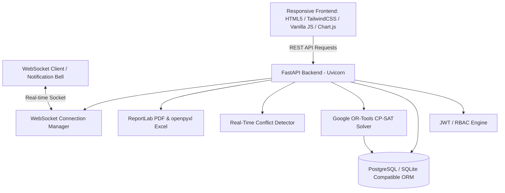

# University Timetable Management & Academic Scheduling Platform
## Architectural Blueprint & System Design

### 1. High-Level Architecture

### 2. Comprehensive Database Relational Model (37 Tables)
1. **Core Auth & Multi-Tenancy**: `users`, `roles`, `permissions`, `user_roles`, `universities`, `campuses`
2. **Academic Hierarchy**: `departments`, `academic_years`, `semesters`, `programs`, `batches`, `sections`
3. **Faculty & Students**: `teachers`, `students`, `teacher_workload`, `teacher_subjects`, `section_subjects`
4. **Curriculum**: `subjects`, `subject_offerings`
5. **Infrastructure**: `buildings`, `rooms`, `labs`
6. **Time & Calendar**: `periods`, `working_days`, `holidays`
7. **Availability & Constraints**: `teacher_availability`, `room_availability`, `class_availability`
8. **Timetable & Scheduling**: `timetable`, `timetable_entries`, `timetable_generation_jobs`, `timetable_generation_results`
9. **Operations & Operations Flow**: `substitutions`, `notifications`, `announcements`, `audit_logs`, `system_settings`

### 3. Constraint-Based Optimization Formulation (OR-Tools CP-SAT)
- **Hard Constraints**:
  - No teacher can teach multiple sections during the same period and day.
  - No classroom/lab can be occupied by multiple sections in the same slot.
  - No section can have multiple classes scheduled in the same slot.
  - Capacity check: Section student count must be <= room capacity.
  - Lab equipment check: Subjects requiring a lab must be assigned to designated lab rooms.
  - Unavailability windows: Teacher/Room/Section unavailable slots strictly excluded ($X_{t,d,p} = 0$).
  - Subject quota: Section must receive exact theory & lab weekly periods.
- **Soft Constraints (Penalized in CP-SAT Objective)**:
  - Subject distribution: Penalize having the same subject repeat on the same day when avoidable.
  - Workload balance: Penalize teacher daily load exceeding target hours.
  - Idle gaps: Penalize isolated single gap periods for students and faculty.
  - Consecutive class limits: Avoid faculty having > 3 consecutive classes without a break.

### 4. Phased Implementation Roadmap
- **Phase 1**: Core configuration, database engine, base models, migrations, and security.
- **Phase 2-4**: Complete entity models (academic hierarchy, faculty, rooms, periods, availability).
- **Phase 5-7**: Timetable CRUD, Google OR-Tools CP-SAT generator, and dynamic conflict detector.
- **Phase 8-10**: Timetable publishing/versioning, role-specific portals (Admin, HOD, Teacher, Student), and substitution engine.
- **Phase 11-13**: WebSocket notification system, Chart.js analytics engine, PDF/Excel export.
- **Phase 14-16**: Automated test suite (pytest), seed script (`seed.py`), Dockerfile, and documentation.
